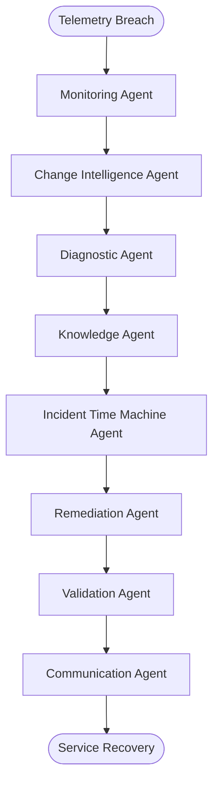

# InfraMedic Architecture & Technical Specification

This document provides a deep dive into the design decisions, database schemas, multi-agent logic, and live streaming workflows of **InfraMedic** — the Autonomous Enterprise Reliability Platform.

---

## 📸 System Dashboard

---

## 💾 Database Schema Specifications (SQL DB)

The application utilizes SQLAlchemy. Database connections default to PostgreSQL (Docker-orchestrated), with a connection-error fallback to local SQLite (`sqlite:///inframedic.db`).

### 1. Telemetry Samples Table (`telemetry_samples`)
Stores real-time health metrics collected from Kubernetes pods, host nodes, or VM computes.
*   **`id`** (INTEGER, PK, auto-increment)
*   **`service_name`** (VARCHAR): The service or component name (e.g., `checkout-api`, `inventory-worker`, `payments-api`, `orders-api`).
*   **`cpu_percent`** (FLOAT): CPU utilization percentage.
*   **`memory_percent`** (FLOAT): Memory utilization percentage.
*   **`error_rate_percent`** (FLOAT): HTTP error rate percentage.
*   **`latency_ms`** (FLOAT): Average response latency in milliseconds.
*   **`collected_at`** (DATETIME): Timestamp when metrics were captured.

### 2. Incidents Table (`incidents`)
Logs active alerts and triggers the multi-agent orchestration workflow.
*   **`id`** (INTEGER, PK, auto-increment)
*   **`title`** (VARCHAR): Summary of the alert (e.g., "High CPU utilization detected on checkout-api").
*   **`description`** (TEXT): Detailed metric details triggering the alert.
*   **`service_name`** (VARCHAR): Affected cloud component.
*   **`metric_name`** (VARCHAR): Breached metric identifier.
*   **`metric_value`** (FLOAT): Metric value at breach time.
*   **`threshold`** (FLOAT): Configured threshold limit.
*   **`severity`** (VARCHAR): Severity classification (`info`, `warning`, `critical`).
*   **`status`** (VARCHAR): State of resolution (`active`, `resolving`, `resolved`).
*   **`agent`** (VARCHAR): The agent responsible for raising/resolving the issue.
*   **`created_at`** (DATETIME): Alert discovery timestamp.
*   **`updated_at`** (DATETIME): Last modification timestamp.
*   **`resolved_at`** (DATETIME, Nullable): Completion timestamp.
*   **`resolution_summary`** (TEXT, Nullable): Post-mortem audit reports generated by the Communication Agent.
*   **`change_intelligence_json`** (TEXT, Nullable): Git commit analysis metadata.
*   **`time_machine_json`** (TEXT, Nullable): Matches from historical incidents.
*   **`risk_score`** (FLOAT): Safety risk score calculated prior to remediation.
*   **`requires_approval`** (BOOLEAN): Human-in-the-loop gate trigger.
*   **`approval_status`** (VARCHAR): Operator gate status (`not_required`, `pending`, `approved`, `rejected`).

### 3. Incident Steps Table (`incident_steps`)
Stores sequential reasoning steps and execution logs for active incident analysis.
*   **`id`** (INTEGER, PK, auto-increment)
*   **`incident_id`** (INTEGER, FK -> `incidents.id`): Link to parent incident.
*   **`agent`** (VARCHAR): Executing agent (e.g., `Diagnostic Agent`).
*   **`message`** (TEXT): Detailed reasoning output or tool execution parameters.
*   **`step_type`** (VARCHAR): Classification (`analysis`, `guardrail`, `remediation`, etc.).
*   **`created_at`** (DATETIME): Log entry timestamp.

### 4. Cloud Resources Table (`cloud_resources`)
Caches discovered cloud services from AWS, Azure, GCP, or Floci local provider.
*   **`id`** (INTEGER, PK, auto-increment)
*   **`resource_type`** (VARCHAR): Category (`compute`, `storage`, `database`, `secret`, `networking`, `cluster`, `load_balancer`).
*   **`resource_id`** (VARCHAR): Provider unique ID (e.g. InstanceId).
*   **`name`** (VARCHAR): Friendly asset name.
*   **`status`** (VARCHAR): Infrastructure operational status (`Running`, `Active`, `Stopped`).
*   **`details_json`** (TEXT, Nullable): Raw JSON payload returned by provider APIs.
*   **`updated_at`** (DATETIME): Last discovery sync timestamp.

---

## 🤖 Multi-Agent Logic & Prompt Engineering

Incidents trigger a **LangGraph StateGraph** comprising eight specialized, collaborative SRE agents:

### Agent Toolsets & Core Actions
1.  **Monitoring Agent**: Constantly polls live metrics (CPU, Memory, error rates) to raise incidents upon threshold breaches.
2.  **Change Intelligence Agent**: Scans recent deployments, Helm releases, and Git commits to correlate configuration drifts with incident timestamps.
3.  **Diagnostic Agent**: Gathers container and host syslogs to extract exception traces and identify connection pool exhaustions or application lockups.
4.  **Knowledge Agent**: Performs semantic lookup against Standard Operating Procedure (SOP) playbooks (e.g., `SOP-023: High CPU in API Gateway`, `SOP-104: Worker Memory Exhaustion`, `SOP-009: Pod CrashLoopBackOff`).
5.  **Incident Time Machine Agent**: Analyzes historical incident databases to identify similar past failures and rank remediations.
6.  **Remediation Agent**: Calculates risk score, triggers operator approval gate if risk exceeds 60%, and deploys the corrective action (`Scale Deployment`, `Restart Service`, `Rollback Deployment`, or SSH/SSM `pkill` commands on the host to terminate stress activity).
7.  **Validation Agent**: Verifies recovery by polling metrics to ensure CPU, memory, and error rates stabilize.
8.  **Communication Agent**: Generates comprehensive summaries targeted to Engineers (detailed debugging data), Managers (SLO impact metrics), and Executives (business metrics & ROI cost-savings summaries).

---

## 🔄 Live Stream Architecture (WebSockets)

1.  **Agent Step Execution**: Each step in the LangGraph graph broadcasts progress updates to the database as `IncidentStep` entries and pushes telemetry live to client endpoints.
2.  **WebSocket Stream**: The route `/ws/incidents/{incident_id}` feeds real-time status updates directly to the React dashboard.
3.  **Delta Push**: When an agent completes a node task, it streams events carrying the agent name, state (`running`, `completed`), reasoning summary, and tool output variables.
4.  **UI Refresh**: Upon completion of the full graph (`Communication Agent` outputs the final summaries), the React dashboard re-fetches the connection registry and resources state to render updated healthy metrics instantly.
